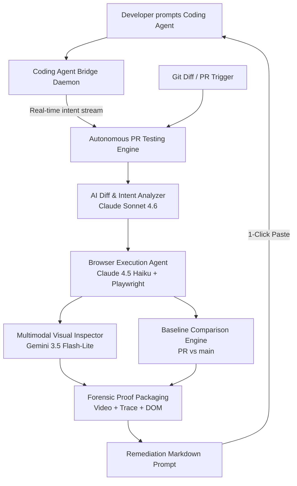

# Autonomous PR Testing & QA Verification Engine

> **One-liner:** An AI system that watches you code — through a CLI/skill plugged into Claude Code, Cursor, Copilot, etc. — and autonomously tests, verifies, and produces forensic proof + one-click fixes for every change you make, without you ever leaving your coding agent.

---

## ⚡ Core Concept: The Closed Loop

Traditional CI catches bugs only when someone explicitly wrote a test for them, and manual QA doesn't scale to how fast AI coding agents ship code. 

This engine pairs two systems into a single closed loop:
1. **Coding Agent Bridge**: Plugs into your coding agent (Claude Code, Cursor). Captures not just *what* changed (files), but *why* — your prompt summary and the agent's internal reasoning — streamed in real time over a persistent WebSocket daemon.
2. **Autonomous PR Testing Engine**: Uses the intent-enriched diff to dynamically plan user journeys, launches a sandboxed browser session via Playwright, executes element-targeted scroll on nested layouts, spots visual regressions, and produces forensic-grade proof (`trace.zip`, `video.webm`, DOM snapshot) + a ready-to-paste remediation prompt.



---

## 🎯 Multi-Model Specialization via AWS Strands Agents SDK

Every AI agent in the platform is powered through the **AWS Strands Agents SDK** (`strands-agents`), routing tasks to specialized foundation models:

| Task Domain | Configured Model | Strands Provider | Why Selected |
| :--- | :--- | :--- | :--- |
| **Code Reasoning & Architecture** | **Claude Sonnet 4.6** (`claude-sonnet-4.6`) | `strands.models.anthropic.AnthropicModel` | Deep semantic code intelligence, understanding git diffs, downstream blast radius mapping, and synthesizing actionable remediation prompts. |
| **Screenshot & Visual Inspection** | **Gemini 3.8 Flash** (`gemini-3.8-flash`) | `strands.models.gemini.GeminiModel` | Multimodal visual leader for pixel-level visual regression detection, layout-shift spotting, and UI defect inspection from raw screenshot bytes. |
| **Browser Navigation & Exploration** | **Claude 4.5 Haiku** (`claude-haiku-4.5`) | `strands.models.anthropic.AnthropicModel` | Fast, low-latency, and cost-effective for DOM traversal, clicking, typing, and element-targeted scrolling without heavy reasoning overhead. |

---

## 🔍 Three-Lane Code Review & Verified Fixer

Independently of the browser-journey engine, every pull request can be reviewed
through three separate lenses. They are separate model calls with separate
severity ladders and separate messages, because they ask different questions and
fail in different ways — collapsing them into one prompt reliably over-weights
style and under-weights anything that matters.

| Lane | Ladder | The question it answers |
| :--- | :--- | :--- |
| **Compliance** | `critical` · `must_fix` · `should_fix` | Which legal, licensing or data-handling obligation does this create or break? |
| **Security** | `must_fix` · `should_fix` · `suggestion` | Is there a path an attacker can actually take from this change? |
| **Code review** | `must_fix` · `should_fix` · `suggestion` | Will this be correct in production? |

Each rung is anchored to a described failure mode
(`agent/src/agent/review/models.py`), and the canonical severity is *derived
from the tier* rather than taken from the model's adjective: a model that calls
a low-impact issue `critical` has picked the top rung, not invented a new one.

### One click, and the fix has to prove itself

A finding can be dispatched to an on-demand repair agent (`POST /review/fix`).
The engine generates several candidate patches, verifies each in a throwaway
sandbox, and keeps the smallest survivor. Nothing trusts the agent's own claim
of success — a candidate is accepted only when all of this holds
(`agent/src/agent/review/verification.py`):

1. **It did not weaken a gate.** Modifying, deleting or disabling an existing
   test, fixture, snapshot, CI workflow or lint config is rejected structurally.
   *Adding* a new test file is required — that is the regression proof, not a
   bypass.
2. **The regression test fails before the fix and passes after it.** A green
   suite alone proves nothing: it is equally consistent with a test that could
   never fail. The test half of the patch is applied to the unpatched tree on
   its own and must fail there.
3. **The build and the pre-existing suite still pass**, so the fix did not buy
   one green check with another.
4. **An adversarial critic failed to falsify it.** A patch that only makes the
   reported symptom disappear — swallowing the exception, widening a type to
   `Any`, special-casing the example — is refuted.

Accepted patches are published as a **new branch and a pull request** against
the branch under review (`agent/src/agent/review/publish.py`). The engine never
commits to a base branch, never bypasses branch protection and never merges, so
an agent-authored change is reviewed like any other.

### Endpoints

* `GET /review/lanes` — the three lanes and their ladders.
* `POST /review/analyze` — run the lanes over an inline `diff` or a server-side
  `repo_dir` + ref range; returns the merged report, each lane's own markdown,
  and the combined report.
* `POST /review/fix` — verify a fix for one finding; optionally publish a branch
  and open a PR.

`repo_dir` is confined to `REVIEW_ALLOWED_ROOTS` (default: the working
directory). See `.env.example` §9.

### Run it without credentials

```bash
cd agent
uv run python scripts/review_demo.py
```

The demo builds a throwaway repository whose feature branch introduces an
authorisation bypass, reviews it, fixes it, and prints the verification
transcript — including the regression test observed failing before the change
and passing after it. The lane replies are scripted, but the diff, the sandbox,
the patch application, the test runs, the branch and the commit are all real.
Pass `--live` to drive the lanes with the configured model instead.

---

## 📁 Repository Structure

```
.
├── agent/                    # Python Agent Core & Testing Engine
│   ├── pyproject.toml        # Dependencies (Strands SDK, Playwright, FastAPI, uv)
│   ├── scripts/              # Executable demo and smoke scripts
│   │   ├── demo_showcase.py  # 5-minute judge pitch simulation
│   │   └── full_loop_smoke.py# Full closed-loop webhook & journey test
│   ├── src/agent/
│   │   ├── analyzer/         # Claude Sonnet 4.6 Diff + Intent Analyzer
│   │   ├── api/              # FastAPI endpoints (runs, dashboard, webhooks, bridge)
│   │   ├── sandbox/          # Zero-host-disk container sandbox: boots first, then
│   │   │                     # clones the PR in-container via docker exec. Source
│   │   │                     # never touches host disk; the --rm container is the
│   │   │                     # only copy and is destroyed when the run ends.
│   │   ├── bridge/           # Coding Agent Bridge CLI & local daemon
│   │   ├── credentials/      # AES-256 encrypted test account store & redaction
│   │   ├── db/               # Supabase PostgreSQL client with local fallback
│   │   ├── journeys/         # Playwright journeys, element-targeted scroll & Gemini visual inspector
│   │   ├── models/           # Strands SDK multi-model factory & role routing
│   │   ├── projects/         # Registry, saved tests, per-repo automation
│   │   ├── review/           # Three-lane code review + verified best-of-N fixer
│   │   │                     #   engine.py       - runs the lanes, merges & ranks
│   │   │                     #   models.py       - per-lane severity ladders
│   │   │                     #   verification.py - what "verified" must mean
│   │   │                     #   fixer.py        - best-of-N sandbox selection
│   │   │                     #   publish.py      - branch + PR, never a merge
│   │   ├── remediation/      # Structured markdown fix prompt generator
│   │   └── runner/           # Baseline comparator (new regression vs pre-existing bug) & pipeline
│   └── tests/                # 180+ unit, integration & real-Docker tests
│
├── web/                      # Next.js 16 Preview Application & Telemetry Dashboard
│   ├── app/
│   │   ├── page.tsx          # Editorial B&W product landing page & architecture
│   │   ├── dashboard/        # Real-time Telemetry Dashboard (Fleet, Repo, Runs, User tiers)
│   │   ├── login/ & register/# Supabase authentication surfaces with seeded sandbox bypass
│   │   └── api/runs/         # Next.js API proxy to Python engine
│   └── .claude/              # Claude Code hooks for real-time intent capture
│
├── supabase/
│   ├── schema.sql            # PostgreSQL schema for intent_logs, runs, and credentials
│   └── migrations/           # Incremental, idempotent SQL (project import RLS, columns)
│
├── idea.md                   # Complete architectural specification & 5-day build plan
├── .gitignore                # Root gitignore covering Python, Node.js, and artifacts
└── README.md                 # System overview and quickstart guide
```

---

## 🧭 PR-Centric Verification Model

The engine reports per **pull request**, not just per run, and every result is a
structured, severity-ranked test case rather than a flat list of journey names.

### Severity taxonomy

Four actionable levels, defined once in `agent/src/agent/analyzer/severity.py`
and used by the engine, the API and the dashboard:

| Level | Meaning |
| :--- | :--- |
| `critical` | Blocks a core flow or risks data integrity — fix before merge |
| `high` | Breaks an important feature or badly degrades the experience |
| `medium` | Noticeable, but the user can still accomplish the goal |
| `low` | Cosmetic, or an edge case with limited impact |

A number is only ever reported when it was measured. An untested fleet has **no**
bug-detection rate, an unreachable engine reports "not measured", and checks that
are not implemented (payload fuzzing, keyboard traps, tab order, text overflow)
report `null`/empty instead of a reassuring default.

### Test cases and findings

`agent/src/agent/runner/test_cases.py` derives, from the evidence the pipeline
already collected:

* one **test case** per executed journey — status, category (`happy_path`,
  `logic`, `edge`, `adversarial`, `accessibility`, `mobile`, `visual`,
  `navigation`), severity, impact, reproduction steps built from real
  navigation events, code pointers, the seeded accounts and mocks that were
  active, and its evidence (video, trace, screenshot, vitals, console errors);
* one **finding** per failure, fingerprinted so the same issue keeps one
  identity across runs and commits;
* an **origin** for every case (`new`, `regression`, `still_broken_verified`,
  `still_broken_inherited`, `carried_forward`, `fixed`) so a pre-existing bug is
  never counted as a regression introduced by the change.

Findings can be **dismissed** from the dashboard. The engine preserves the
dismissal when it re-observes the issue, so a judged finding stops being
reported.

### Incremental reporting

Each run is compared against the previous run for the same branch
(`PRInsightStore.previous_test_cases`). That is what decides origin precisely:
a case that passed last time and fails now is a **regression**, one that failed
and now passes is **fixed**, and a case the diff did not touch is **carried
forward** — listed, marked `verified_this_commit = false`, and never counted as
a verified result for the current commit. A carried-forward failure does not
raise a new finding (the existing one stays open from the run that verified it)
and cannot turn the run red on its own.

### Running on selected pull requests

`/dashboard/pull-requests` → **Run on pull requests** lists the open PRs the
GitHub App can see for an imported repository (`GET /api/github/pull-requests`,
proxied to the engine's `GitHubAppClient.list_pull_requests`). Select up to ten
and dispatch verification for each against its current head commit
(`POST /api/pull-requests/run`). The selection is recorded in `pull_requests`
first, so the PR appears in the dashboard even if the engine cannot be reached,
and each run is queued by the engine rather than fired in parallel.

### Saved tests (reusable suite)

A run's test cases are a record of that run; saving one makes it part of the
repository's regression suite. On a pull request's test cases, **Save as test**
writes to `saved_tests` (`/api/tests`, managed at `/dashboard/tests`). Every
enabled saved test is injected into each later run's plan as required coverage
(`agent/src/agent/projects/saved_tests.py`), so a flow someone chose to protect
keeps being exercised instead of only appearing in the run that discovered it.

Saving is deliberately opt-in: a suite that grows automatically from every run
becomes noise and stops being a signal.

### Hardening

* External runs (`POST /runs/external`) reject targets that resolve to a
  private, loopback, link-local or cloud-metadata address. A self-hosted
  deployment that genuinely verifies an app on its own network can set
  `ALLOW_PRIVATE_EXTERNAL_TARGETS=true` (knowingly re-enabling SSRF).
* The AgentCore `/invocations` shim requires the bearer token. Set
  `AGENTCORE_TRUST_GATEWAY=true` only when a SigV4-authenticating gateway sits
  in front of the engine.
* Expensive endpoints are rate-limited: forced runs (10/min/repo), external runs
  (6/min/target), copilot turns (20/min), plus per-user limits on the web
  copilot, journey runner and checkout routes.

### Per-repository automation

`agent/src/agent/projects/automation.py` reads `projects.settings.automation`:

* **mode** — `active` (review and post), `silent` (review, dashboard only),
  `paused` (no automatic reviews);
* **draft PRs**, **bot PRs**, and **comments** toggles;
* `@pr-agent test|check`, `@pr-agent inspect <route>` and `@pr-agent apply`
  comment commands for on-demand work.

### Context & Secrets

Per repository, `project_context` stores **variables**, **secrets** and **seed
data**. Secrets are encrypted with AES-256-GCM (the same `v2:` format the engine
and dashboard share) and are write-only: the API never returns the value.
Variables and secrets are injected into the test container as environment
variables; secret values are added to the run's redaction list so they cannot
survive in an artifact, log or stored result. Seed data and variable names are
passed to the planning agent; secret values are never placed in a prompt.

### Data model

Apply `supabase/migrations/20260913000000_pr_centric_model.sql` (or re-run
`supabase/schema.sql`) to create `pull_requests`, `test_cases`, `findings`,
`saved_tests`, `project_context`, `team_members` and `usage_events`. Until it is
applied the new dashboard pages explain the missing-migration state instead of
erroring.

---

## 🚀 Quickstart

### Prerequisites
- **Python**: `>= 3.12` with [uv](https://github.com/astral-sh/uv) installed
- **Node.js**: `>= 20.x` and `npm`

### 1. Backend Setup (`agent`)
```bash
cd agent
uv sync
uv run playwright install chromium
```

### 2. Frontend Setup (`web`)
```bash
cd web
npm install
npm run build
```

### 3. Docker Compose Setup (One-Command Launch)
To boot both the Python Engine API (port 8000) and the Next.js Telemetry Dashboard (port 3000) inside Docker:
```bash
docker compose up --build -d
```
- **Control Center UI & API**: `http://localhost:8000/dashboard`
- **Next.js Telemetry Dashboard**: `http://localhost:3000/dashboard`
- **Forensic Artifacts**: Mounted locally at `./artifacts`

To view logs or tear down:
```bash
docker compose logs -f
docker compose down
```

---

## 🎬 Running the Demos

### 5-Minute Pitch Demo (`demo_showcase.py`)
Simulates the exact judge pitch in under 5 minutes:
1. Connected web application tracking developer intent.
2. Claude Code introduces a subtle form validation constraint.
3. Developer runs on-demand check: `agent-bridge check`.
4. Browser agent catches downstream regression on seeded test account.
5. Generates forensic proof (`trace.zip`, `video.webm`, DOM snapshot, and intent context).
6. One-click remediation prompt applied by Claude Code.
7. Re-run verifies all tests GREEN.

```bash
cd agent
uv run python scripts/demo_showcase.py
```

### Full Closed-Loop Smoke Test (`full_loop_smoke.py`)
Executes the complete GitHub App webhook ingestion flow, dynamic exploratory browser journeys on `/dashboard` and `/checkout`, and Check Run updates:

```bash
cd agent
uv run python scripts/full_loop_smoke.py
```

---

## 🧪 Running Automated Tests

Run the full pytest suite covering multi-model Strands routing, browser agents, element-targeted scroll, baseline comparator, session persistence, credential redaction, freshness dedup, in-container cloning (real Docker), and measured-vs-fabricated metric handling:

```bash
cd agent
uv run pytest -v
```

---

## 💻 Running the Live Platform

### Start the Python Engine API & Dashboard (Port 8000)
```bash
cd agent
uv run uvicorn agent.main:app --port 8000 --reload --reload-dir src

```
- **Control Center UI**: `http://localhost:8000/dashboard`
- **Health check**: `http://localhost:8000/health`

### Start the Next.js Telemetry Dashboard (Port 3000)
```bash
cd web
npm run dev
```
- **Live Telemetry Dashboard**: `http://localhost:3000/dashboard`
- **Landing & Architecture Page**: `http://localhost:3000/`

### Using the Coding Agent Bridge CLI
```bash
# Check status of local daemon and active git branch
uv run agent-bridge status

# Emit an intent event (automatically hooked via .claude/hooks/post-tool.sh)
uv run agent-bridge emit --files "app/checkout/page.tsx" --action "edit" --prompt "Add promo discount" --reasoning "Boost checkout conversion"

# Trigger an on-demand verification and wait for the remediation prompt in terminal
uv run agent-bridge check --branch feature/quick-checkout --wait
```
