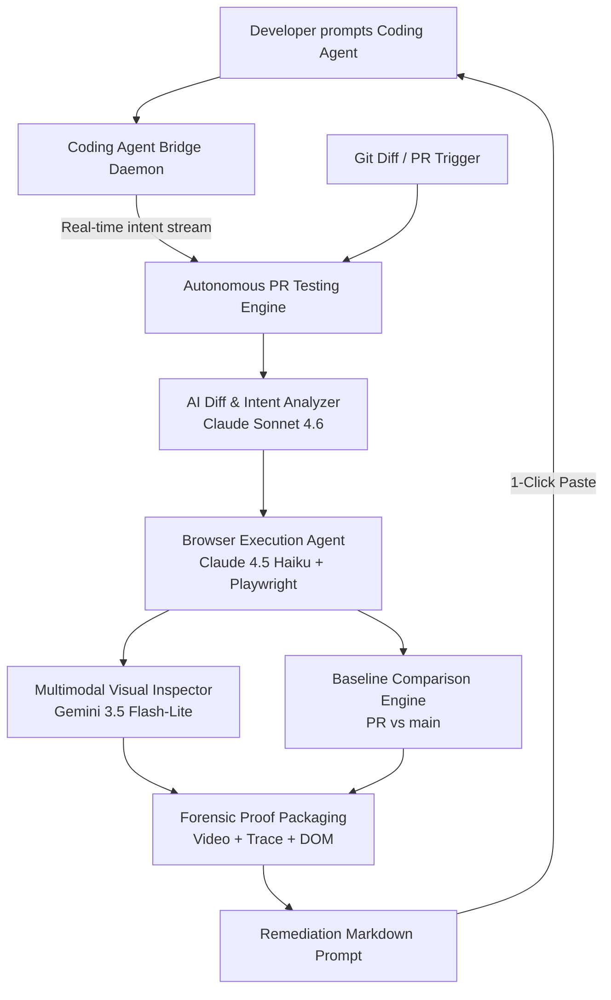

# Autonomous PR Testing & QA Verification Engine

> **One-liner:** An AI system that watches you code — through a CLI/skill plugged into Claude Code, Cursor, Copilot, etc. — and autonomously tests, verifies, and produces forensic proof + one-click fixes for every change you make, without you ever leaving your coding agent.

---

## ⚡ Core Concept: The Closed Loop

Traditional CI catches bugs only when someone explicitly wrote a test for them, and manual QA doesn't scale to how fast AI coding agents ship code. 

This engine pairs two systems into a single closed loop:
1. **Coding Agent Bridge**: Plugs into your coding agent (Claude Code, Cursor). Captures not just *what* changed (files), but *why* — your prompt summary and the agent's internal reasoning — streamed in real time over a persistent WebSocket daemon.
2. **Autonomous PR Testing Engine**: Uses the intent-enriched diff to dynamically plan user journeys, launches a sandboxed browser session via Playwright, executes element-targeted scroll on nested layouts, spots visual regressions, and produces forensic-grade proof (`trace.zip`, `video.webm`, DOM snapshot) + a ready-to-paste remediation prompt.



---

## 🎯 Multi-Model Specialization via AWS Strands Agents SDK

Every AI agent in the platform is powered through the **AWS Strands Agents SDK** (`strands-agents`), routing tasks to specialized foundation models:

| Task Domain | Configured Model | Strands Provider | Why Selected |
| :--- | :--- | :--- | :--- |
| **Code Reasoning & Architecture** | **Claude Sonnet 4.6** (`claude-sonnet-4.6`) | `strands.models.anthropic.AnthropicModel` | Deep semantic code intelligence, understanding git diffs, downstream blast radius mapping, and synthesizing actionable remediation prompts. |
| **Screenshot & Visual Inspection** | **Gemini 3.5 Flash-Lite** (`gemini-3.5-flash-lite`) | `strands.models.gemini.GeminiModel` | Multimodal visual leader for pixel-level visual regression detection, layout-shift spotting, and UI defect inspection from raw screenshot bytes. |
| **Browser Navigation & Exploration** | **Claude 4.5 Haiku** (`claude-haiku-4.5`) | `strands.models.anthropic.AnthropicModel` | Fast, low-latency, and cost-effective for DOM traversal, clicking, typing, and element-targeted scrolling without heavy reasoning overhead. |

---

## 📁 Repository Structure

```
.
├── agent/                    # Python Agent Core & Testing Engine
│   ├── pyproject.toml        # Dependencies (Strands SDK, Playwright, FastAPI, uv)
│   ├── scripts/              # Executable demo and smoke scripts
│   │   ├── demo_showcase.py  # 5-minute judge pitch simulation
│   │   └── full_loop_smoke.py# Full closed-loop webhook & journey test
│   ├── src/agent/
│   │   ├── analyzer/         # Claude Sonnet 4.6 Diff + Intent Analyzer
│   │   ├── api/              # FastAPI endpoints (runs, dashboard, webhooks, bridge)
│   │   ├── bridge/           # Coding Agent Bridge CLI & local daemon
│   │   ├── credentials/      # AES-256 encrypted test account store & redaction
│   │   ├── db/               # Supabase PostgreSQL client with local fallback
│   │   ├── journeys/         # Playwright journeys, element-targeted scroll & Gemini visual inspector
│   │   ├── models/           # Strands SDK multi-model factory & role routing
│   │   ├── remediation/      # Structured markdown fix prompt generator
│   │   └── runner/           # Baseline comparator (new regression vs pre-existing bug) & pipeline
│   └── tests/                # 20 automated unit & integration tests
│
├── web/                      # Next.js 16 Preview Application & Telemetry Dashboard
│   ├── app/
│   │   ├── page.tsx          # Editorial B&W product landing page & architecture
│   │   ├── dashboard/        # Real-time Telemetry Dashboard (Fleet, Repo, Runs, User tiers)
│   │   ├── login/ & register/# Supabase authentication surfaces with seeded sandbox bypass
│   │   └── api/runs/         # Next.js API proxy to Python engine
│   └── .claude/              # Claude Code hooks for real-time intent capture
│
├── supabase/
│   └── schema.sql            # PostgreSQL schema for intent_logs, runs, and credentials
│
├── idea.md                   # Complete architectural specification & 5-day build plan
├── .gitignore                # Root gitignore covering Python, Node.js, and artifacts
└── README.md                 # System overview and quickstart guide
```

---

## 🚀 Quickstart

### Prerequisites
- **Python**: `>= 3.12` with [uv](https://github.com/astral-sh/uv) installed
- **Node.js**: `>= 20.x` and `npm`

### 1. Backend Setup (`agent`)
```bash
cd agent
uv sync
uv run playwright install chromium
```

### 2. Frontend Setup (`web`)
```bash
cd web
npm install
npm run build
```

---

## 🎬 Running the Demos

### 5-Minute Pitch Demo (`demo_showcase.py`)
Simulates the exact judge pitch in under 5 minutes:
1. Connected web application tracking developer intent.
2. Claude Code introduces a subtle form validation constraint.
3. Developer runs on-demand check: `agent-bridge check`.
4. Browser agent catches downstream regression on seeded test account.
5. Generates forensic proof (`trace.zip`, `video.webm`, DOM snapshot, and intent context).
6. One-click remediation prompt applied by Claude Code.
7. Re-run verifies all tests GREEN.

```bash
cd agent
uv run python scripts/demo_showcase.py
```

### Full Closed-Loop Smoke Test (`full_loop_smoke.py`)
Executes the complete GitHub App webhook ingestion flow, dynamic exploratory browser journeys on `/dashboard` and `/checkout`, and Check Run updates:

```bash
cd agent
uv run python scripts/full_loop_smoke.py
```

---

## 🧪 Running Automated Tests

Run the full pytest suite (20 tests covering multi-model Strands routing, browser agents, element-targeted scroll, baseline comparator, and freshness dedup):

```bash
cd agent
uv run pytest -v
```

---

## 💻 Running the Live Platform

### Start the Python Engine API & Dashboard (Port 8000)
```bash
cd agent
uv run uvicorn agent.main:app --port 8000 --reload
```
- **Control Center UI**: `http://localhost:8000/dashboard`
- **Health check**: `http://localhost:8000/health`

### Start the Next.js Telemetry Dashboard (Port 3000)
```bash
cd web
npm run dev
```
- **Live Telemetry Dashboard**: `http://localhost:3000/dashboard`
- **Landing & Architecture Page**: `http://localhost:3000/`

### Using the Coding Agent Bridge CLI
```bash
# Check status of local daemon and active git branch
uv run agent-bridge status

# Emit an intent event (automatically hooked via .claude/hooks/post-tool.sh)
uv run agent-bridge emit --files "app/checkout/page.tsx" --action "edit" --prompt "Add promo discount" --reasoning "Boost checkout conversion"

# Trigger an on-demand verification and wait for the remediation prompt in terminal
uv run agent-bridge check --branch feature/quick-checkout --wait
```
